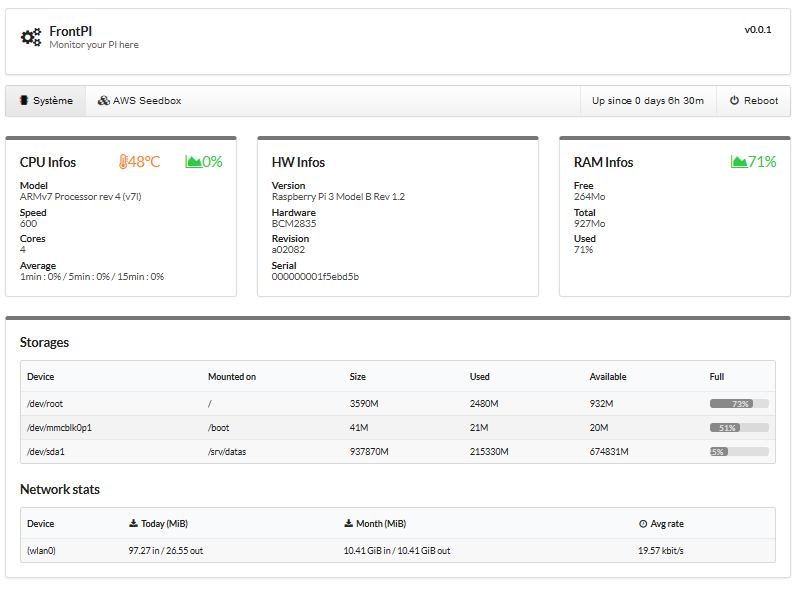
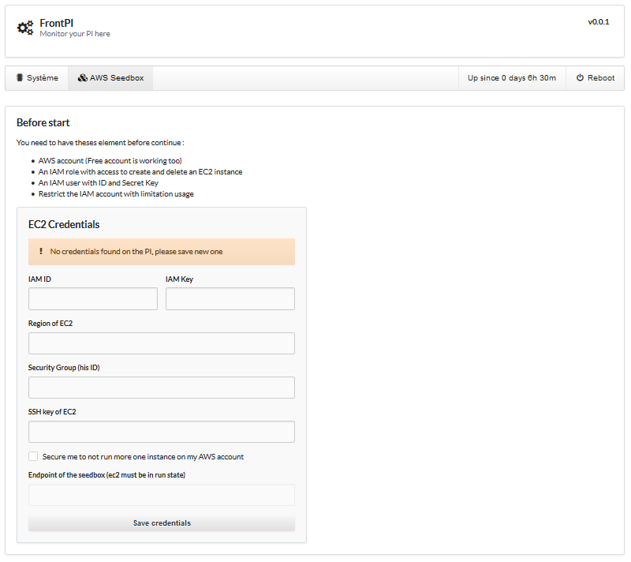

## FrontPI

This interface show statistics usage of your PI and system information such as :
- CPU informations
- MotherBoard model
- Serial



If you have an AWS Account, you can manage an EC2 instance to create a Seedbox on demand.
A built in script will mount from `sshfs` the folder `/srv/datas/ `of you pi in his folder `/home/admin/rtorrent/finish`
And move finished torrent into it (only when they're finished).



## Configure FrontPi

1. You need to install these packages :

`sudo apt install vnstat`

2. Install nodeJs by following this guide : https://nodejs.org/en/download/package-manager/#debian-and-ubuntu-based-linux-distributions

2. Go to the folder of your choice and run these commands lines

```
git clone https://github.com/nimaskji/frontpi.git
cd frontpi/
npm install
```

3. Run the FrontPi interface with `node bin/www` 

4. To automate the startup of FrontPi add this command line into your crontab

`@reboot /usr/bin/node /folder/of/frontpi/bin/www`

5. You need to create the following folder 

`mkdir /srv/datas`, this folder is mapped by the EC2 from a ssh tunnel to store session and finished torrent

## Configure the Bottstraping script, edit `bootstrap.sh`

1. The only thing you need to change is the lines of your private ssh key needed to access to your PI (I will not explain how to configure PubKey access on your PI) starting at line 15. And update the variables on the top of the script : 
```
USER="pi"			# Put user associated with your private key access on your PI
HOST="monip.org"		# Put your public ip address of your PI 
PORT=3000			# Put the exposed ssh port of your PI (3000 is an example, standard is 22)
```

2. The script is encoded in base64 when FrontPi start end will generate `bootstrap.encoded.json` file, it will be used for the creation of the EC2 with AWS-SDK.

3. You can edit the script as you want but becareful with what you do in it !
